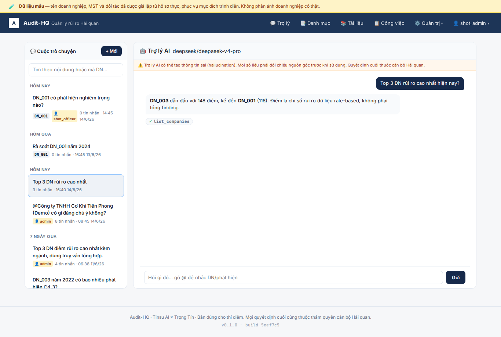
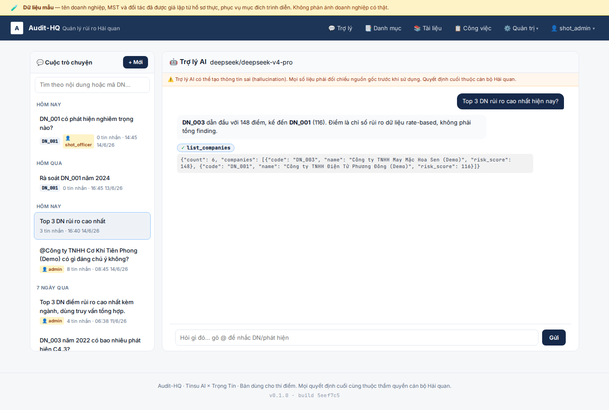
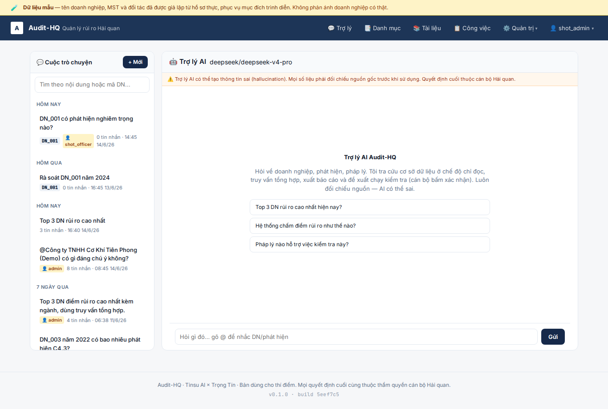
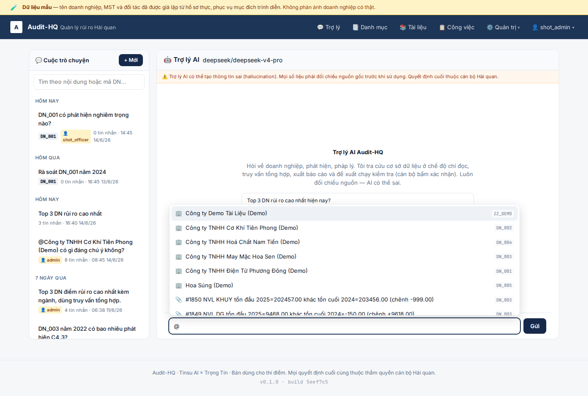
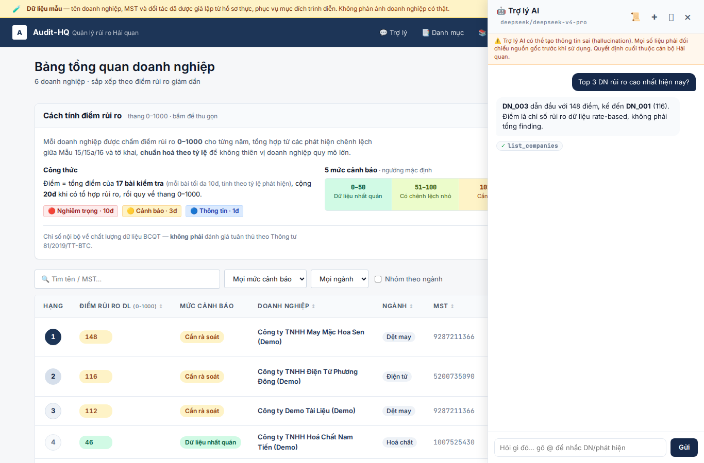

# Feature: Chat redesign — tool-pill gọn, trang /chat, mention, admin xem-tất-cả

**Built** 2026-06-14 trên `main` (nối tiếp feature [permissions-auth-and-chat](../2026-06-14-permissions-auth-and-chat/brief.md), mục P3 redesign chat).

**Driver:** chat trước đây chỉ là FAB + panel; tool-use chiếm quá nhiều chỗ; không có
URL cho từng cuộc; không nhắc nhanh được DN/finding. Nâng lên cho dùng thí điểm thật.

## Scope (what shipped)

### Phase 1 — Tool-use compact
- Bỏ hộp vàng mỗi tool (⏳ gọi + ✓ kết quả 300 ký tự). Thay bằng **dải pill gọn**:
  `⚙ tên_tool …` (đang chạy) → `✓ tên_tool` (xong, ~20px). Bấm pill mới bung preview.
- Khớp running→done theo thứ tự backend phát call→result; spinner tự dừng nếu stream đứt.

### Phase 2 — Lõi chung + trang /chat + URL conversation
- **`chat-core.js`**: lõi dùng chung (stream SSE, render markdown/citation, tool-pill,
  API conversation, render danh sách). Sidebar lẫn trang đều mount lên lõi này.
- **`sidebar.js`**: rút còn mount mỏng (panel/lịch sử/gợi ý).
- **Trang `/chat`** (`chat.html` + `chat-page.js` + `chat-page.css` + route `chat_page.py`):
  2 cột (danh sách trái + chat phải), **URL `/chat/{id}`** qua `pushState` + back/forward,
  nav "💬 Trợ lý", FAB ẩn trên trang này.

### Phase 3 — Mention @DN / @finding
- Endpoint `/api/chat/mentions?q=` (lọc theo DN được phân công).
- Autocomplete `@` trong lõi → chạy cả sidebar lẫn trang; chèn chip, gửi kèm `mentions`.
- Backend `_resolve_mentions` xác thực lại phạm vi rồi inject vào system prompt.

### Phân quyền chat (theo yêu cầu pilot)
- AI chỉ chạm DN của user (đã có từ P1: `allowed_codes` → `run_tool`, query_sql TEMP VIEW).
- Cuộc trò chuyện riêng theo user; **admin xem được hết** (giám sát) + badge 👤 chủ cuộc;
  **xoá/ghi vẫn owner-only** (admin không lỡ tay xoá lịch sử người khác).

## Decisions
- Lõi chung 1 file vanilla (không build chain) — 2 mount cùng engine, không nhân đôi logic.
- Mention chèn text + theo dõi token; xoá khỏi câu = bỏ mention. Server resolve lại scope
  (không tin code/id client) → mention không phải lối lách phân quyền.
- Admin read-all NHƯNG không delete-all: ranh giới "giám sát" ≠ "quản trị dữ liệu người khác".

## Risks / notes
- Trang `/chat` đếm 30 cuộc gần nhất; admin nhiều user có thể cần phân trang sau.
- Mention search dùng `ilike` + `slug` (ASCII-fold) → gõ không dấu vẫn khớp qua slug.

## Screenshots
- Tool-pill gọn (deep-link `/chat/{id}`), list admin thấy cả cuộc officer + badge chủ:
  
- Bấm pill → bung preview JSON:
  
- Trang `/chat` (admin xem tất cả cuộc, có badge chủ):
  
- Mention `@` autocomplete (🏢 DN + 📎 finding, kèm mã):
  
- Regression: sidebar FAB ở trang thường vẫn render pill gọn (lõi chung):
  

## Verification
- 533 test pass, ruff sạch, `node --check` cả 3 JS.
- Test mới: `test_chat_ownership.py` (6 — admin read-all, owner-only delete, officer cô lập),
  `test_chat_mentions.py` (4 — endpoint scoped + `_resolve_mentions` chặn DN ngoài phạm vi).
- `ui_smoke.py` deterministic (seed cuộc có tool message để replay pill, KHÔNG gọi LLM).

## Next step
- Phase mở rộng (nếu cần): phân trang list cho admin; mention nhiều thực thể; rich chip input.
