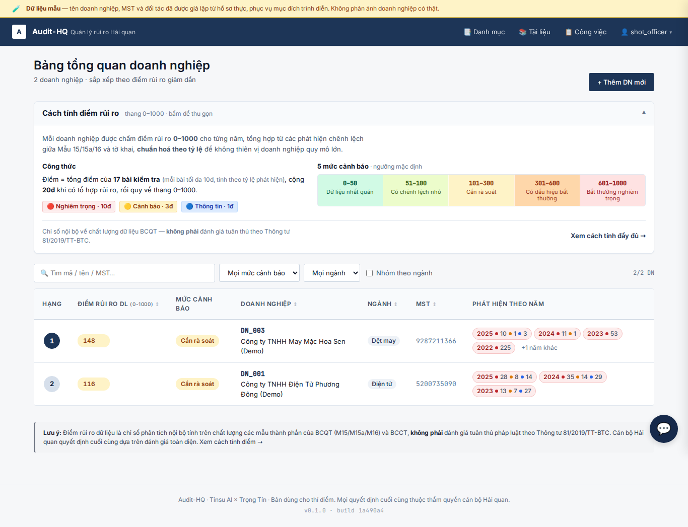
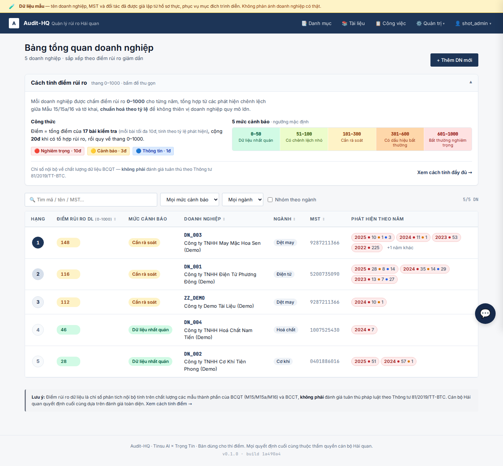
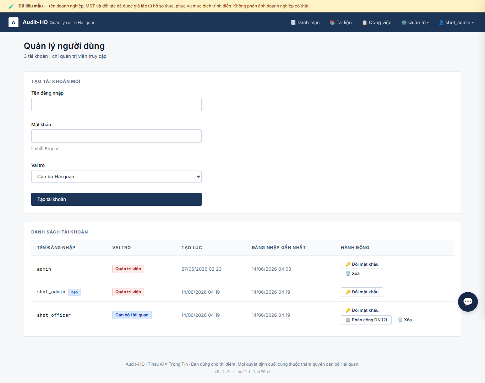
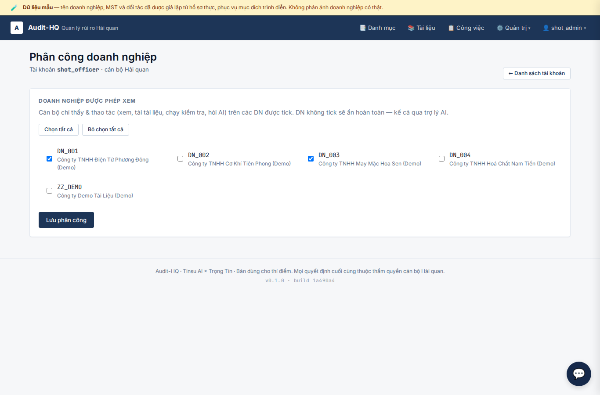
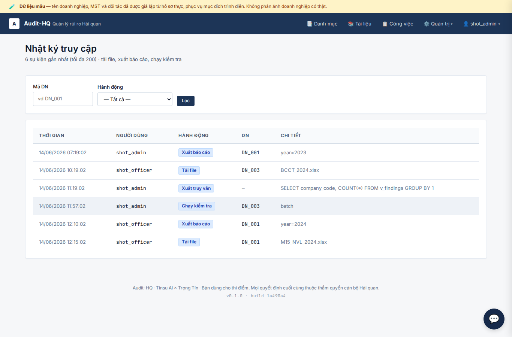
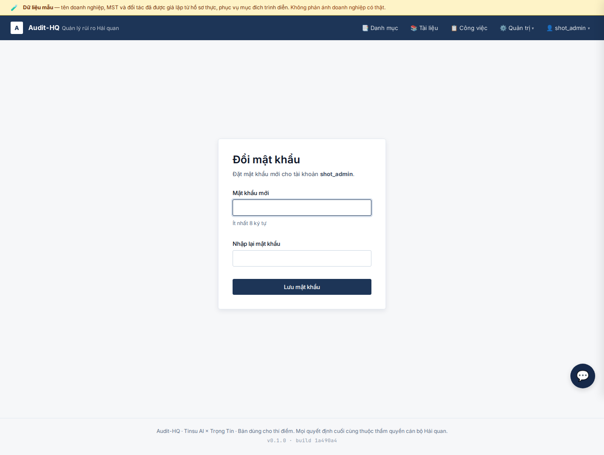
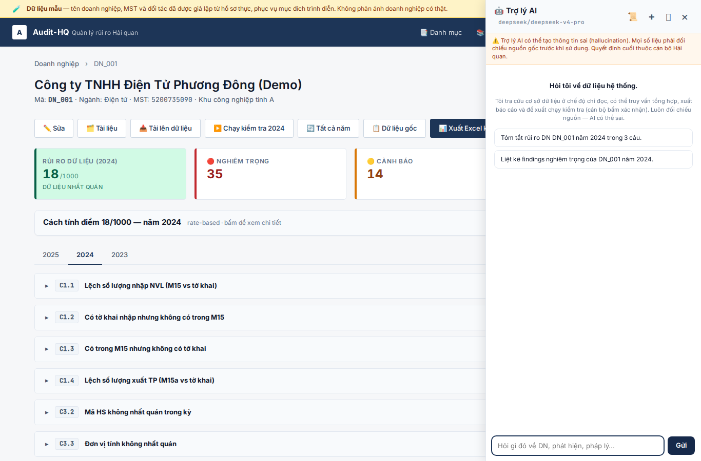
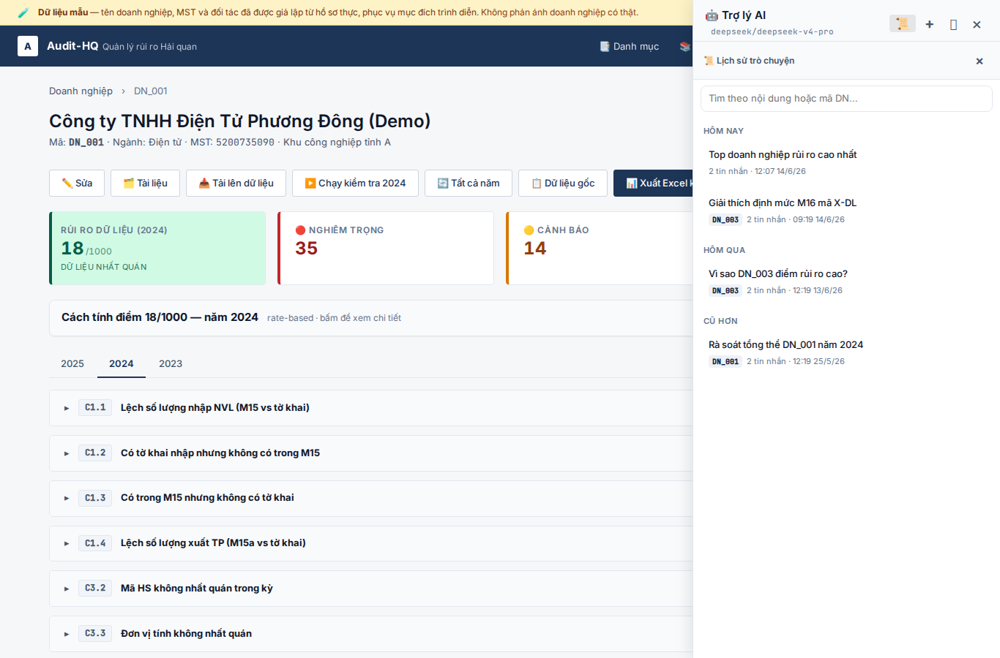

# Feature: per-DN permissions, pilot auth hardening, chat redesign

**Shipped** 2026-06-14 on branch `feat/permissions-auth-hardening` (commits
`92cdc04` P1+P2, `1a490a4` P3). Migrations `b1c2d3e4f5a6`, `c2d3e4f5a6b7`.
520 tests passing, ruff clean.

**Driver:** chuyển từ demo nội bộ sang **thí điểm thật, dữ liệu DN thật**. Trước
đây mọi user thấy mọi DN; auth chỉ đủ cho demo; chat chỉ biết DN/năm từ URL. Ba
việc dưới đây làm app sẵn sàng cho cán bộ thật dùng trên dữ liệu thật.

## Scope (what shipped)

### P1 — Phân quyền theo DN (cô lập dữ liệu)
- Bảng nối `user_companies` (nhiều-nhiều). `app/scoping.py`: `allowed_company_ids/codes`,
  `get_company_or_404`, `can_access_company_id`. DN ngoài phạm vi → **404 (không 403)**
  để không lộ sự tồn tại.
- Cưỡng chế **server-side ở mọi lối vào**: danh sách DN + mọi route `/companies/{code}`
  và `/findings/{id}`. Người tạo DN tự được phân công DN đó.
- **AI dùng chung ranh giới**: `run_tool(..., allowed_codes)` chặn tool theo `company_code`,
  lọc `list_companies`/`get_finding`; `query_sql` lọc bằng **TEMP VIEW** shadow `v_*`
  (an toàn cả với aggregate; schema-qualified `main.v_*` bị guard chặn).
- Trang admin phân công DN cho officer dưới `/admin/users`.

### P2 — Siết auth cho dùng thật
- **Rate-limit login** theo IP (`app/login_guard.py`) — khoá tạm sau 8 lần sai/5 phút.
- **Nhật ký truy cập** (`AccessEvent` + `app/audit.py` + `/admin/audit`): ghi egress/hành
  động (tải file, xuất báo cáo, xuất truy vấn SQL, chạy kiểm tra). Cảnh báo startup nếu
  `AUTH_PASSWORD` mặc định.
- **Validate magic-byte upload** (xlsx=`PK`, xls=OLE2) cộng size + đuôi.
- Trang tự đổi mật khẩu `/change-password` (giàn buộc-đổi giữ lại nhưng đã TẮT theo yêu
  cầu — "hơi phiền"; bật lại dễ).

### P3 — Redesign chat
- **Context phân giải cao**: `getPageContext()` bóc thêm mã hàng, bảng dữ liệu + bộ lọc,
  nhãn loại trang; `build_page_context()` render → AI biết "đang xem mã X của DN_001 /
  bảng M15 lọc 'ABC' / chi tiết phát hiện". Gợi ý thích ứng theo mã hàng/bảng.
- **History thuận tiện**: ô search (nội dung/mã DN), nhóm theo thời gian (Hôm nay/Hôm
  qua/7 ngày qua/Cũ hơn), chip DN mỗi cuộc (suy từ `page_url_seed`).

## Decisions
- Mô hình **nội bộ (officer↔DN)**, không multi-tenant client — user chốt. Schema giữ sạch
  để thêm tenant sau nếu cần. (Xem `.ai/DECISIONS.md` #14.)
- **TEMP VIEW** thay vì wrap LIMIT ngoài: wrap ngoài không chặn được COUNT/SUM; temp view
  lọc tại nguồn.
- **Seed admin bootstrap KHÔNG buộc đổi mật khẩu** (tránh khoá cứng tests/ops) — chỉ cảnh
  báo startup. Buộc-đổi cho tài khoản admin tạo đã được TẮT theo phản hồi user.

## Risks / notes
- Rate-limit **in-memory/1 process** — reset khi restart; đủ làm chậm brute-force pilot.
- Frontend JS không có test harness trong repo → phủ bằng `node --check` + unit test backend
  + ảnh chụp dưới đây.
- Deploy: chạy `alembic upgrade head` + đặt env `AUTH_PASSWORD` trên prod.

## Screenshots

Chụp bằng `ui_smoke.py` (seed user throwaway + hội thoại, chụp, rồi dọn).

### P1 — Phân quyền theo DN
- Officer chỉ thấy DN được phân công (2 DN):
  
- Admin thấy tất cả DN:
  
- Trang Người dùng — nút "Phân công DN (n)" cho officer:
  
- Trang phân công DN (checkbox):
  

### P2 — Siết auth
- Nhật ký truy cập (`/admin/audit`):
  
- Trang tự đổi mật khẩu:
  

### P3 — Redesign chat
- Sidebar bám ngữ cảnh trang (gợi ý theo DN/năm đang xem):
  
- Lịch sử: search + nhóm theo thời gian + chip DN:
  

## Verification
- `pytest` → 520 passed; `ruff check` clean.
- Tests mới: `tests/test_scoping.py`, `tests/test_p2_hardening.py`,
  `tests/test_system_prompt_context.py`.

## Next step
Merge `feat/permissions-auth-hardening` → `main` → CI deploy (nhớ migration +
`AUTH_PASSWORD`). P4 tiềm năng (chưa làm): bật lại buộc-đổi mật khẩu nếu cần,
audit cho thao tác xem trang, multi-tenant client.
