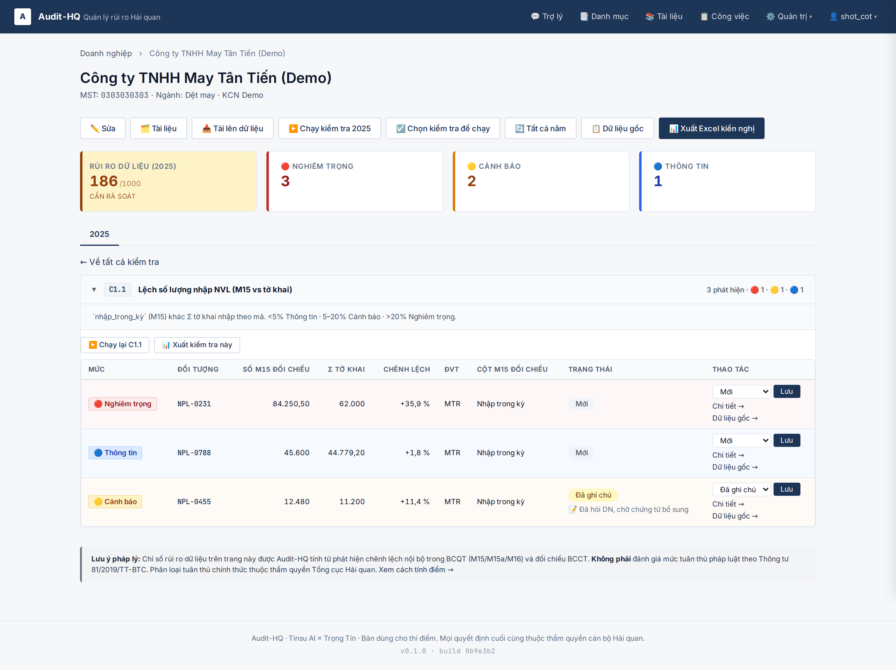
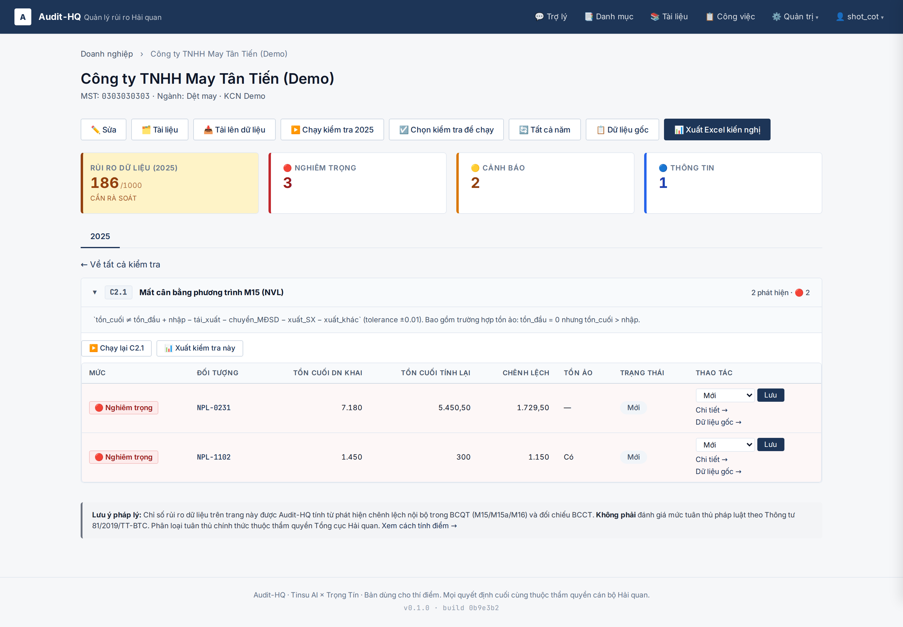
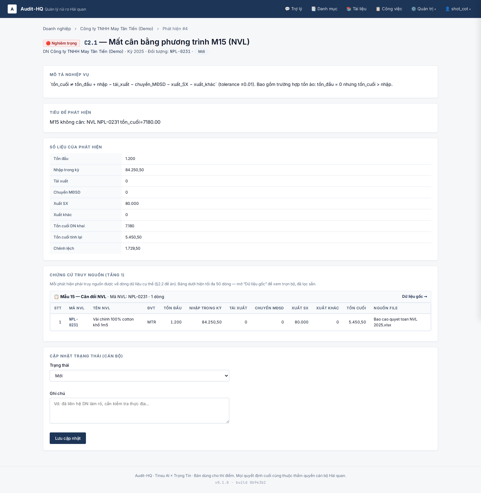
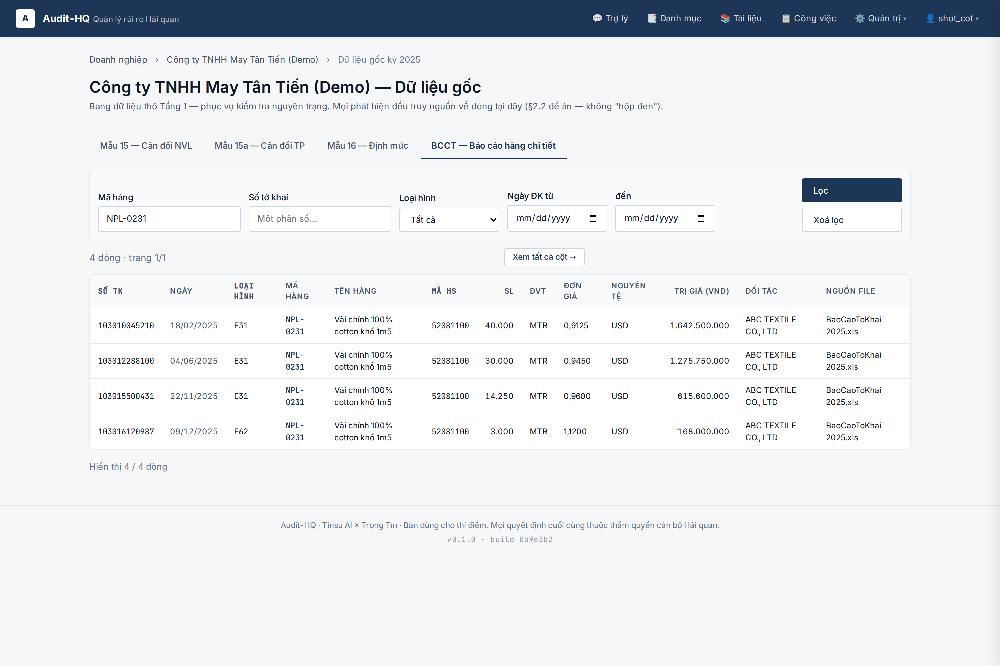
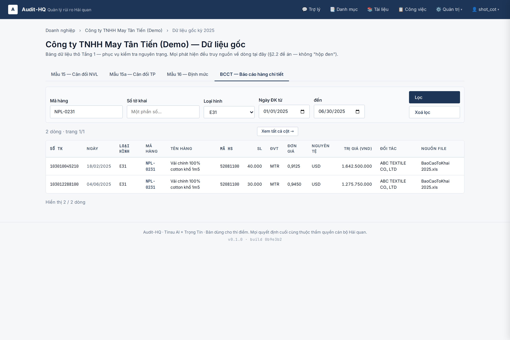
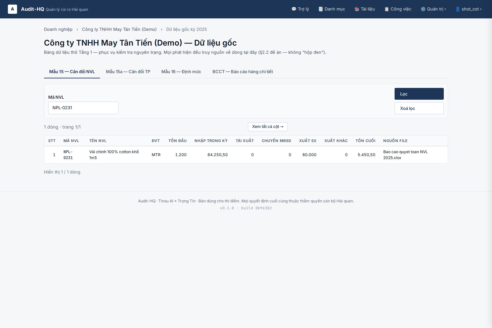
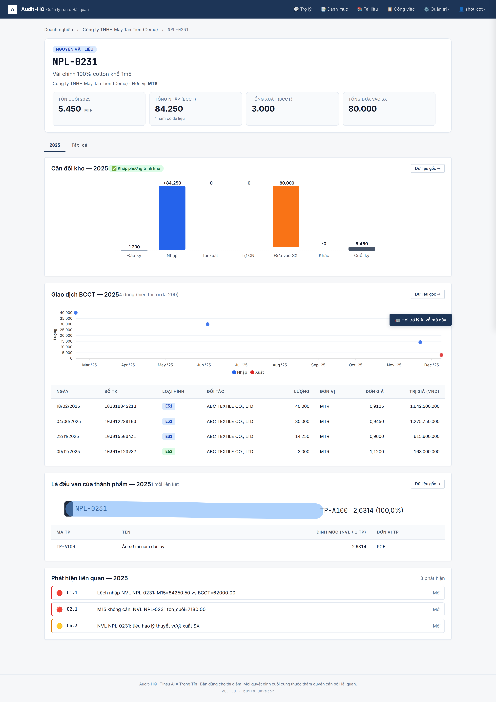
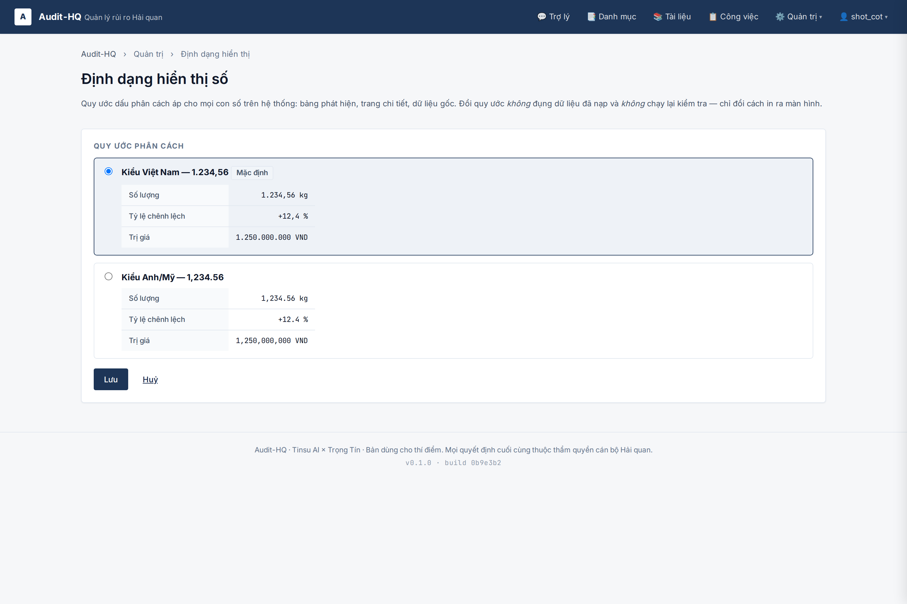

# E2E proof — cột số tách khỏi mô tả · nhãn tiếng Việt · link vào dữ liệu gốc

Ảnh chứng cho ba phản hồi sau buổi demo (Tú Anh, 02/08/2026):

1. Cán bộ ngồi nhìn số trên hệ thống vẫn phải bật Excel lên đối chiếu → phải link
   thẳng vào dữ liệu gốc, đã lọc sẵn theo mã và năm; màn dữ liệu gốc phải đa năng hơn.
2. Mô tả lặp đi lặp lại, mã đã có ở cột "Đối tượng" mà mô tả nhắc lại, các con số
   nằm trong chuỗi mô tả nên rất khó đọc → tách số ra cột tương ứng.
3. Rà lại toàn bộ nhãn hiển thị: phải là tên tiếng Việt chứ không phải tên biến /
   tên cột; phần trăm phải có `%`, tiền tệ phải có đơn vị, số lớn phải có phân cách.

## Chạy lại

Server throwaway riêng, **KHÔNG đụng DB live hay cổng 8200 của user**. Kill theo PID,
không bao giờ `pkill -f uvicorn`.

```bash
SCRATCH=<thư mục tạm>            # DB + log của lượt chụp
WORKDB="$SCRATCH/smoke.sqlite"; rm -f "$WORKDB" "$WORKDB"-wal "$WORKDB"-shm
DATABASE_URL="sqlite:///$WORKDB" .venv/bin/alembic upgrade head

setsid env DATABASE_URL="sqlite:///$WORKDB" \
    .venv/bin/uvicorn app.main:app --port 8332 --no-access-log \
    > "$SCRATCH/smoke-server.log" 2>&1 &
echo $! > "$SCRATCH/smoke.pid"

M_BASE=http://127.0.0.1:8332 DATABASE_URL="sqlite:///$WORKDB" PYTHONPATH=. \
    .venv/bin/python .ai/features/2026-08-02-finding-columns-raw-data/ui_smoke.py

kill "$(cat "$SCRATCH/smoke.pid")"
```

`ui_smoke.py` tự seed rồi tự dọn (user `shot_cot` + DN `DEMO_COT_SO` + setting
`number_format`), nên chạy nhiều lần không để lại rác.

**Sửa `app/` xong phải KHỞI ĐỘNG LẠI server rồi mới chụp** — uvicorn chạy không
`--reload`, process cũ giữ module cũ. Đã dính một lượt: sửa bộ cột C2.1 mà ảnh vẫn
ra bảng 10 cột của bản trước.

## Ảnh

Mở file này trên github.com để xem ảnh hiện thẳng trong trang. Ảnh **không nhúng
được vào phần mô tả Pull Request**: repo là private, mà GitHub tải ảnh trong
markdown của PR/issue qua proxy camo — camo tải ẩn danh nên nhận 404 (đã đo:
`raw.githubusercontent.com` trả 404 khi không kèm token, 200 khi có). Đường dẫn
tương đối trong file markdown của repo thì đi lối phục vụ blob đã xác thực, nên
render bình thường.

### 01 — Bảng phát hiện tách cột số

C1.1: bảng **không còn cột "Mô tả"**. Số tách thành cột riêng — `Số M15 đối chiếu` ·
`Σ tờ khai` · `Chênh lệch` (có dấu và `%`) · `ĐVT` · `Cột M15 đối chiếu`. Mã chỉ
xuất hiện MỘT lần ở cột "Đối tượng". Ghi chú cán bộ chuyển xuống dưới ô Trạng thái.
Mỗi dòng có link `Dữ liệu gốc →`. Đủ ba mức nghiêm trọng / cảnh báo / thông tin.



### 02 — C2.1: cân đối thành cột, không tràn ngang

`Tồn cuối DN khai` · `Tồn cuối tính lại` · `Chênh lệch` · `Tồn ảo` (Có/—, không phải
`true`). Bộ cột dừng ở bốn cột nên hai cột thao tác vẫn nằm trong màn hình — trải
trọn phương trình cân đối ra 10 cột thì nút bấm bị đẩy ra ngoài.



### 03 — Trang chi tiết phát hiện: nhãn tiếng Việt

Khoá `details` hiện bằng nhãn tiếng Việt (`Tồn cuối DN khai`, không phải
`closing_reported`). Khối chứng cứ gọi **tên biểu mẫu** `Mẫu 15 — Cân đối NVL` thay
cho tên bảng DB `nvl_balances`, bộ lọc đọc thành câu `Mã NVL: NPL-0231` thay cho
JSON thô, kèm link `Dữ liệu gốc →`.



### 04 — Dữ liệu gốc BCCT, đã lọc sẵn theo mã

Mở từ link của phát hiện, **ô "Mã hàng" đã điền sẵn** `NPL-0231`. Bộ lọc đủ: mã · số
tờ khai · loại hình · khoảng ngày. Cột `Nguồn file` in **tên file**
(`BaoCaoToKhai 2025.xls`), không in đường dẫn máy chủ. Đơn giá giữ 4 chữ số
(`0,9125`), trị giá có phân cách, ngày dd/mm/yyyy.



### 05 — Lọc chồng theo loại hình và khoảng ngày

Mã + loại hình `E31` + khoảng ngày 01/01–30/06 → còn 2 trong 4 dòng.



### 06 — Đổi tab vẫn giữ bộ lọc

Đổi tab sang Mẫu 15, **bộ lọc mã giữ nguyên** (trước đây đổi tab là mất lọc, phải gõ
lại). Bộ lọc số tờ khai / loại hình / ngày tự ẩn vì bảng BCQT không có các cột đó.



### 07 — Trang chi tiết mã: link dữ liệu gốc từng khối

Mỗi khối (cân đối kho · giao dịch BCCT · định mức) có nút `Dữ liệu gốc →` trỏ đúng
bảng tương ứng, đã lọc sẵn mã.



### 08 — Trang chọn quy ước hiển thị số

`/admin/hien-thi`: chọn quy ước phân cách, mỗi lựa chọn có bảng xem trước ba loại số
(số lượng · tỷ lệ · trị giá).



### 09 — Đổi quy ước, bảng đổi theo

Đổi sang quy ước Anh/Mỹ → **đúng bảng ở ảnh 01** đổi thành `84,250.50` · `+35.9 %`.
Chứng minh setting áp thật, không phải nhãn trang trí.


## Lỗi thật ảnh chụp bắt được

**1. Bảng C2.1 tràn ngang, hai cột thao tác bị đẩy khỏi màn hình.** Bản đầu trải
trọn phương trình cân đối thành 10 cột số; cộng 4 cột cố định thành 14 cột. Ảnh cho
thấy `Trạng thái` và `Thao tác` bị cắt — cán bộ phải cuộn ngang mới bấm được nút lưu.
Đã rút bộ cột C2.1 còn `tồn cuối DN khai / tồn cuối tính lại / chênh lệch / tồn ảo`,
C2.2 còn ba cột; các thành phần đầu vào vẫn đủ ở trang chi tiết và bảng chứng cứ.

**2. `ui_smoke.py` để lại setting bẩn giữa hai lượt chạy.** Ảnh 09 ghi
`number_format=en` vào DB throwaway mà `_purge` không xoá, nên lượt chụp SAU ra số
kiểu Anh ở toàn bộ ảnh. Đã thêm xoá setting vào `_purge`, và đặt lại quy ước VN
**qua giao diện** ở đầu lượt chụp — xoá thẳng trong DB không đủ vì server là process
riêng, cache setting 30s.

## Không chứng minh được bằng bộ ảnh này

Ảnh chụp trên dữ liệu seed minh hoạ, không phải file thật của doanh nghiệp. Chúng
chứng minh **cách render** (cột, nhãn, định dạng, đường link), **không** chứng minh
adapter đọc đúng cột từ file Excel thật.
