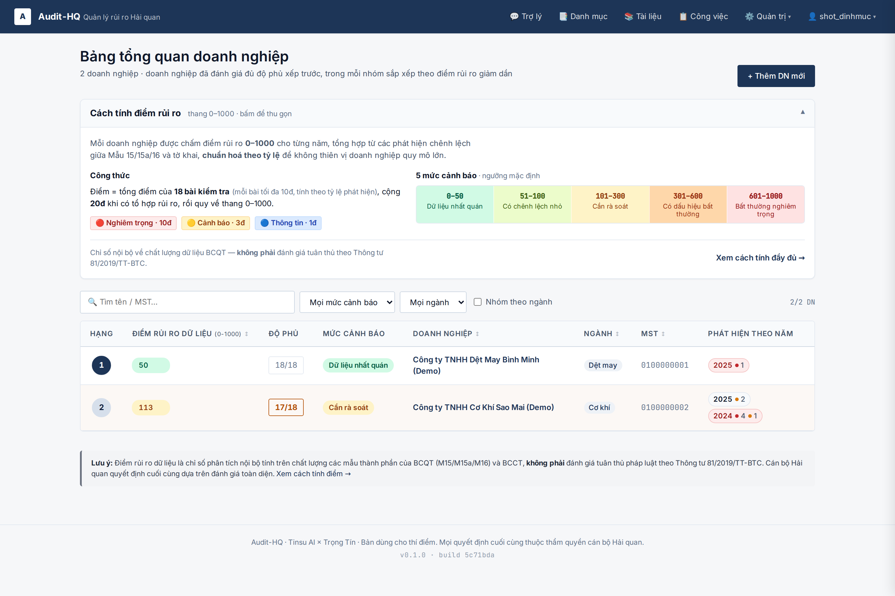
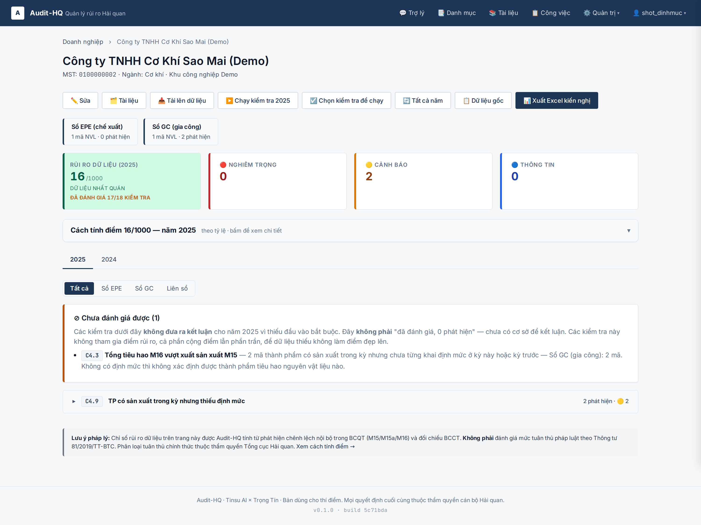
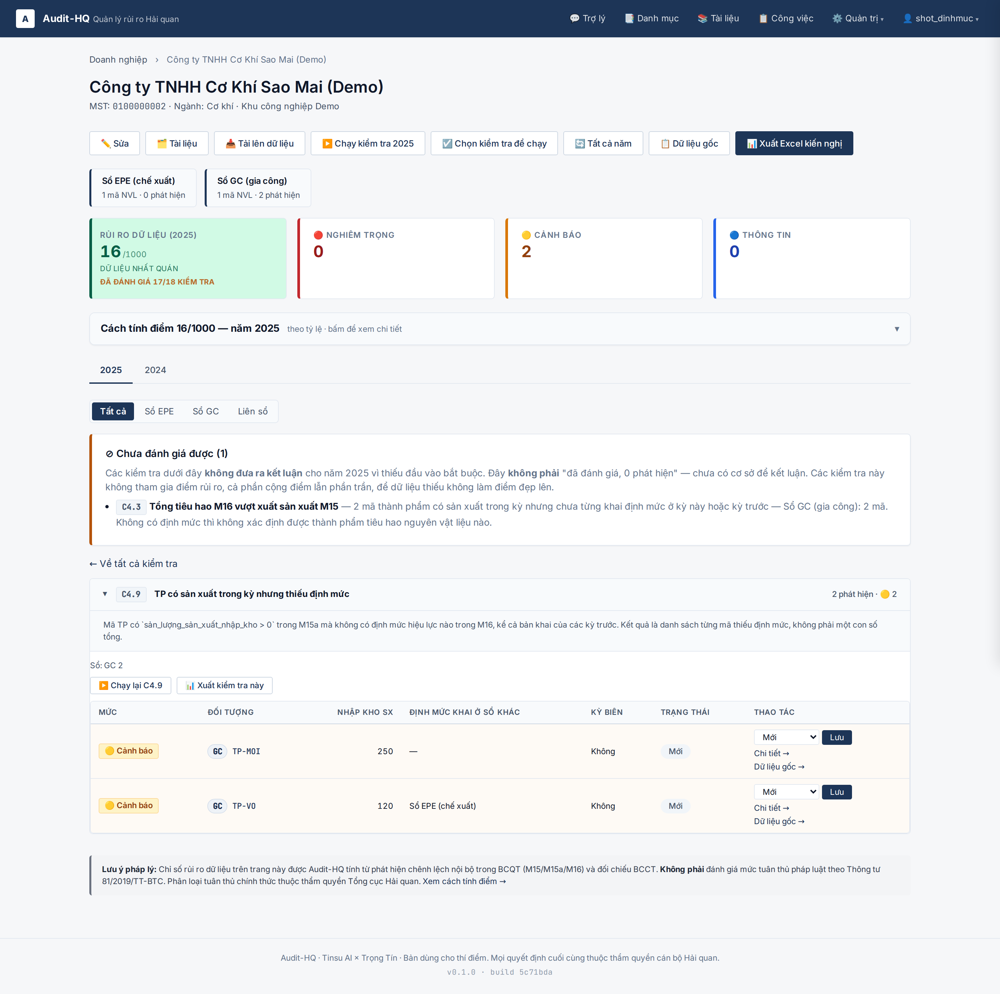
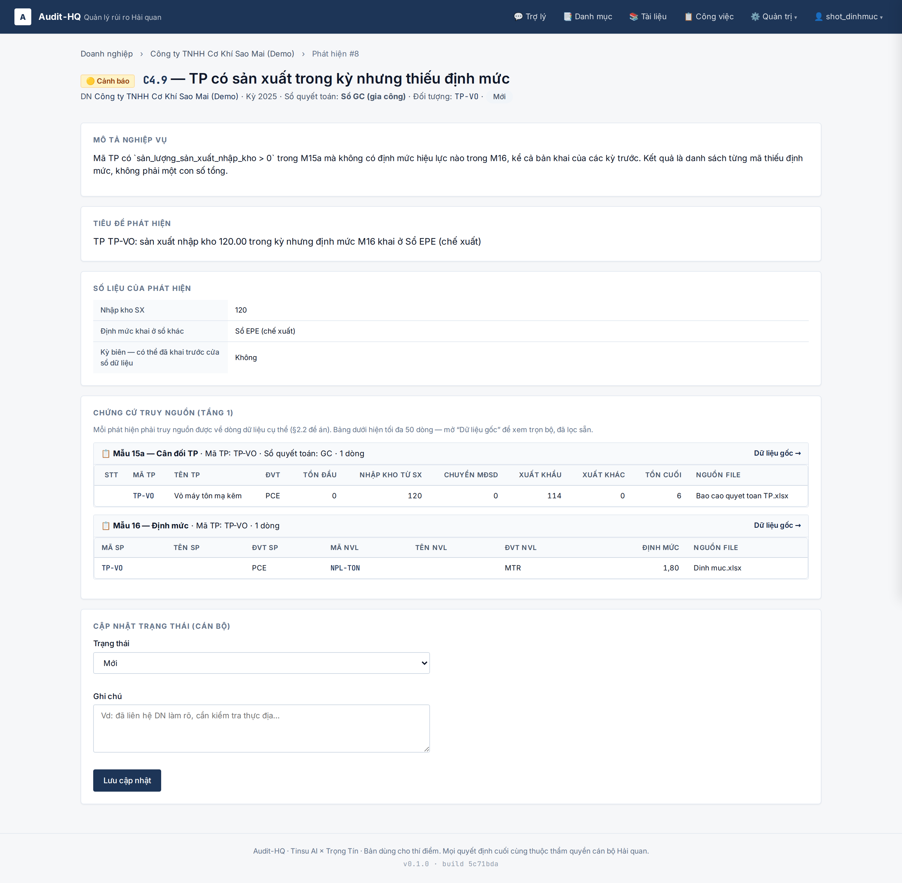
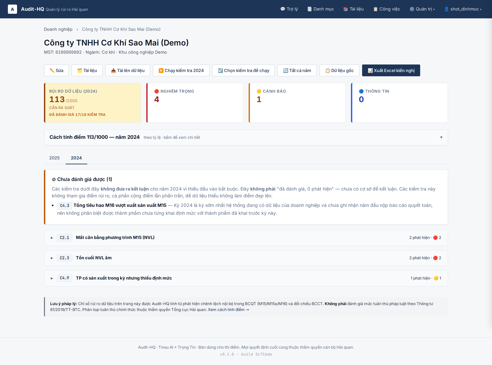
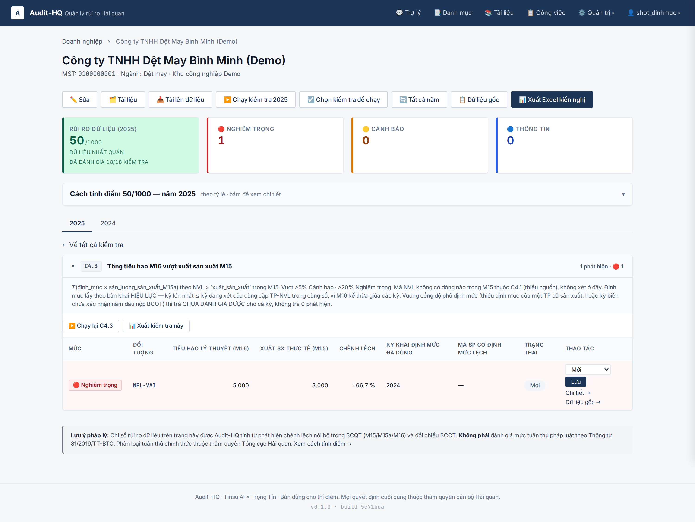
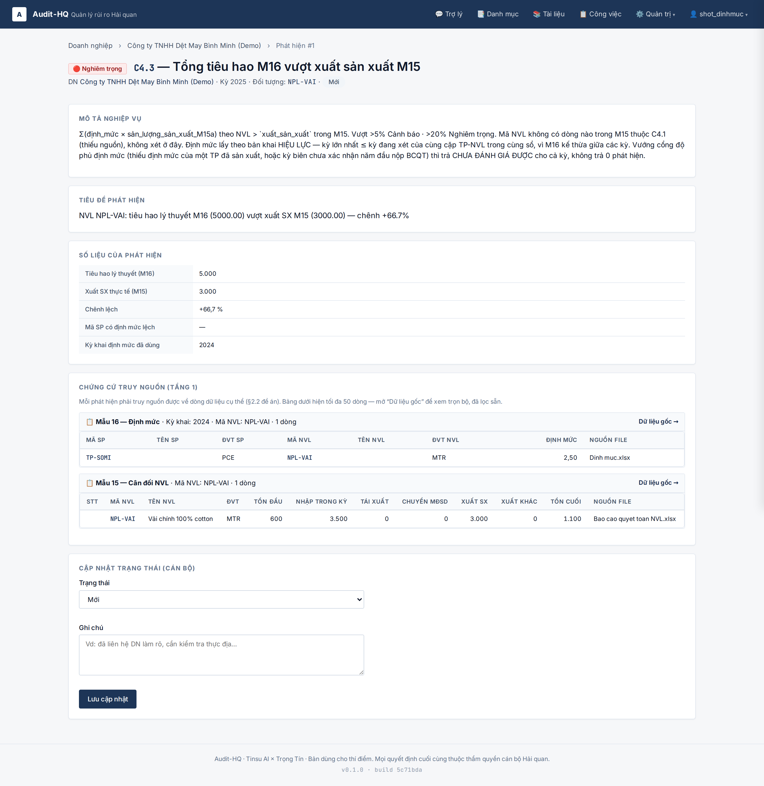
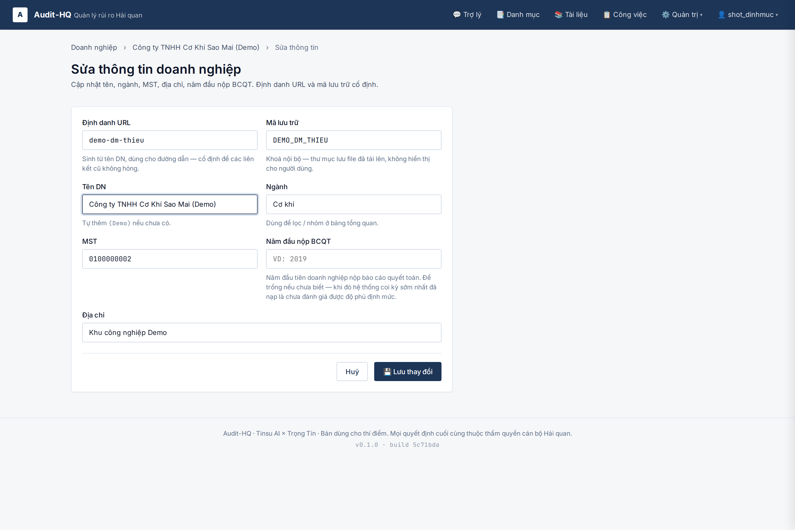
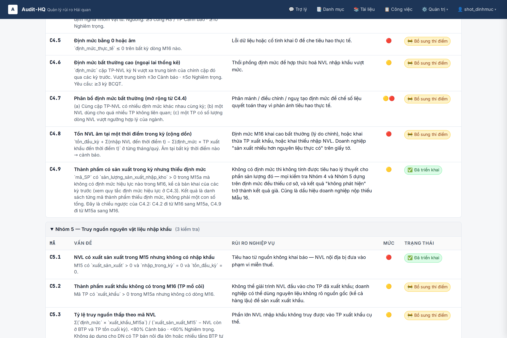

# Issue #56 — ảnh E2E + ghi chú kỹ thuật

Phần **I** là ảnh chứng cho bảy ticket #57–#63 và ba quyết định owner 06/08/2026.
Phần **II** là ghi chú sự thật về code, viết lúc phân tích — giữ lại, đã đánh dấu
mục nào xong.

Đọc phạm vi và số đo ở: `yeu-cau.md` (làm gì) → `grill-state.md` (chốt gì + bằng
chứng) → `tickets.md` (bảy ticket). Nhật ký phiên cài đặt:
`.ai/sessions/2026-08-06-implement-issue-56-bay-ticket.md`.

---

# I · Ảnh E2E

## Chạy lại

Server throwaway riêng, **KHÔNG đụng DB live hay cổng 8200 của user**. Kill theo PID,
không bao giờ `pkill -f uvicorn`.

```bash
SCRATCH=<thư mục tạm>            # DB + log của lượt chụp
WORKDB="$SCRATCH/smoke56.sqlite"; rm -f "$WORKDB" "$WORKDB"-wal "$WORKDB"-shm
DATABASE_URL="sqlite:///$WORKDB" .venv/bin/alembic upgrade head

setsid env DATABASE_URL="sqlite:///$WORKDB" \
    .venv/bin/uvicorn app.main:app --port 8333 --no-access-log \
    > "$SCRATCH/smoke56-server.log" 2>&1 &
echo $! > "$SCRATCH/smoke56.pid"

M_BASE=http://127.0.0.1:8333 DATABASE_URL="sqlite:///$WORKDB" PYTHONPATH=. \
    .venv/bin/python .ai/features/2026-08-05-issue-56-data-completeness/ui_smoke.py

kill "$(cat "$SCRATCH/smoke56.pid")"
```

`ui_smoke.py` tự seed rồi tự dọn (user `shot_dinhmuc` + hai DN `DEMO_DM_*`), chạy
nhiều lần không để lại rác. **Sửa `app/` xong phải KHỞI ĐỘNG LẠI server rồi mới
chụp** — uvicorn chạy không `--reload`, process cũ giữ module cũ.

Ảnh **là kết quả `run_checks()` chạy thật** trên dữ liệu seed, không phải `Finding`
dựng tay. Hai pháp nhân bịa:

| DN | Dựng để chứng minh |
|---|---|
| `DEMO_DM_DU` — Dệt May Bình Minh | Đủ độ phủ. Khai định mức 2024, **2025 không khai lại** → C4.3 vẫn tính được nhờ định mức kế thừa (#60). `first_bcqt_year = 2024` xác nhận 2024 là năm đầu nộp BCQT nên 2024 không phải kỳ biên (#57 mở khoá #62). |
| `DEMO_DM_THIEU` — Cơ Khí Sao Mai | Thiếu độ phủ. 2024 là kỳ biên chưa xác nhận; 2025 có thành phẩm sản xuất mà chưa từng khai định mức → C4.3 `not_evaluable` (#58 + #62). Hai sổ EPE/GC để có ca "định mức khai ở sổ khác". |

## Ảnh

Mở file này trên github.com để xem ảnh hiện thẳng trong trang.

### 01 · Danh sách DN — cột Độ phủ, xếp hạng tách nhóm

Quyết định 06/08 (1). Dệt May Bình Minh **điểm 50, độ phủ 18/18** đứng hạng 1; Cơ Khí
Sao Mai **điểm 113, độ phủ 17/18** xuống hạng 2. Điểm cao hơn mà vẫn xếp sau — điểm là
trung bình trên các luật CHẤM ĐƯỢC nên hai nhóm độ phủ không so ngang được. Trộn chung
một cột thì DN thiếu dữ liệu trồi lên đầu danh sách "sạch".



### 02 · Chưa đánh giá được, kèm lý do — và độ phủ ngay cạnh điểm

Ticket #58 + #62. Khối "⊘ Chưa đánh giá được (1)" nói rõ **đây không phải "đã đánh
giá, 0 phát hiện"**, và C4.3 mang lý do đầy đủ: *2 mã thành phẩm có sản xuất trong kỳ
nhưng chưa từng khai định mức — Sổ GC (gia công): 2 mã*. Dưới điểm là
**ĐÃ ĐÁNH GIÁ 17/18 KIỂM TRA**.



### 03 · C4.9 — liệt kê TỪNG mã thiếu định mức

Ticket #61, mã catalog mới C4.9 (đề án `audit-hq` @ `c5a5c3c`). Anh Dũng gọi đây là
cốt lõi: danh sách từng mã, không phải một con số tổng. Hai ca nằm cạnh nhau —
`TP-MOI` thiếu hẳn (cột "Định mức khai ở sổ khác" = —), `TP-VO` có định mức nhưng khai
ở **Sổ EPE (chế xuất)** trong khi sản xuất ở sổ GC.



### 04 · C4.9 — ca "định mức khai ở sổ khác"

Quyết định 06/08 (3). Hành vi không đổi: định mức sổ EPE **vẫn không** phủ sản lượng
sổ GC (ADR #19), cổng vẫn bắn. Chỉ câu chữ đổi — nói đúng rằng hồ sơ có tồn tại và nằm
ở sổ nào, thay vì để cán bộ đi đòi doanh nghiệp một file đã nộp rồi.



### 05 · Kỳ biên — chưa xác nhận năm đầu nộp BCQT

Quyết định Q1 + ticket #57. Lý do in đủ: *Kỳ 2024 là kỳ sớm nhất hệ thống đang có dữ
liệu của doanh nghiệp và chưa ghi nhận năm đầu nộp báo cáo quyết toán, nên không phân
biệt được thành phẩm chưa từng khai định mức với thành phẩm đã khai trước kỳ này.*
Các check khác (C2.1, C2.3, C4.9) vẫn chạy — cổng chỉ chặn C4.3.



### 06 · C4.3 chạy được nhờ định mức kế thừa

Ticket #60. Kỳ 2025 của Dệt May Bình Minh **không có dòng Mẫu 16 nào** — định mức 2,5
khai năm 2024 vẫn hiệu lực. Cột "Kỳ khai định mức đã dùng" ghi 2024. Lọc đúng
`period_year == 2025` như trước thì mã này mất định mức và C4.3 im lặng.



### 07 · Chứng cứ định mức trỏ về KỲ ĐÃ KHAI

Phát hiện thuộc kỳ 2025, khối chứng cứ ghi **Mẫu 16 — Định mức · Kỳ khai: 2024**. Giữ
`period_year = kỳ phát hiện` thì mở khối chứng cứ ra là bảng rỗng — vi phạm yêu cầu
truy nguồn §5.1 của đề án.



### 08 · Trường "Năm đầu nộp BCQT" trên form sửa DN

Ticket #57. Để trống là hợp lệ, nghĩa là **chưa biết** — và khi chưa biết thì kỳ sớm
nhất mặc định chưa đánh giá được.



### 09 · C4.9 trong danh mục kiểm tra

Danh mục 49 → 50 kiểm tra, nhóm 4 từ 8 → 9. Sửa repo đề án TRƯỚC theo `AGENTS.md`,
rồi mới thêm `CatalogEntry` ở repo này.



## Lỗi thật bộ ảnh này bắt được

**1. Mẫu số `m16` bằng 0 khi DN không khai lại định mức — mọi phát hiện C4.3 của kỳ đó
rơi khỏi điểm rủi ro.** Seed `DEMO_DM_DU` kỳ 2025 (định mức kế thừa, 0 dòng `norms`
trong kỳ) ra **điểm 0** dù có một phát hiện Nghiêm trọng. `_count_distinct_m16` đếm
`Norm.period_year == year`, mà #60 vừa làm C4.3 đánh giá được ở kỳ không có dòng nào;
mẫu số 0 → `compute_rule_score` trả 0. Nghĩa là **DN ngừng khai lại định mức thì điểm
tự đẹp lên** — đúng cái loạt ticket #56 sinh ra để chặn. Đã sửa: mẫu số đếm theo định
mức HIỆU LỰC; điểm 0 → 50. Đo trên pilot: 4/8 (DN, kỳ) đổi mẫu số (DN 8/2025
8.165 → 9.885 · DN 10/2024 1.737 → 1.865 · DN 10/2025 2.662 → 2.995 · DN 10/2026
2.565 → 3.316); **không kỳ nào ở pilot rơi về 0**, nên lỗi chỉ lộ ra nhờ ca seed.

**2. Danh sách DN vẫn ghi "sắp xếp theo điểm rủi ro giảm dần".** Sau khi tách nhóm
theo độ phủ thì câu đó nói sai thứ tự đang hiện. Đã sửa.

**3. Nhãn cột `boundary_period` dài gấp đôi các cột số.** Đã rút còn "Kỳ biên" ở bảng
qua `COLUMN_LABEL_OVERRIDES`, trang chi tiết giữ nhãn đầy đủ.

## Không chứng minh được bằng bộ ảnh này

- Ảnh chụp trên **dữ liệu seed bịa**. Chúng chứng minh **cách render và luật check**,
  không chứng minh adapter đọc đúng cột từ file Excel thật.
- **Ticket #63 (BCCT đọc cột theo nhãn) không có ảnh** — việc ở tầng adapter, không
  đổi màn hình nào. Bằng chứng của nó là 7 fixture trong `tests/test_bcct_columns.py`
  và lượt quét 38 file thật trong `data/`.
- **Cổng review WS1 vẫn chưa bắn cho BCCT** — cột đoán theo vị trí có nhãn bằng chứng
  nhưng file vẫn hiện "Đã kiểm".
- Ảnh 02 hiện **16/1000 · "Dữ liệu nhất quán"** trong khi C4.3 chưa đánh giá được. Đó
  đúng là hạn chế đã ghi ở `STATUS.md`: điểm là trung bình trên các luật chấm được nên
  vẫn có thể trông đẹp; **độ phủ 17/18 in ngay dưới là thứ chặn cách đọc sai đó**.

---

# II · Ghi chú kỹ thuật (viết lúc phân tích)

> Không có quyết định nào trong phần này — chỉ là sự thật về code, thứ tốn công tìm và
> dễ vấp lại. Mục nào đã xong thì đánh dấu tại chỗ.

## Nhánh chưa merge liên quan trực tiếp

`fix/c43-multiplier-p07`, commit `4bf5333` — **ĐÃ cherry-pick vào
`feat/data-completeness-gate`**, xoá nhánh được. Đổi số nhân C4.3
`SpBalance.export_qty` → `intake_qty`.

P-07 chốt BA việc code, nhánh làm việc thứ nhất. Hai việc còn lại:

**(a) Tách cột (6) khỏi (7) ở `app/adapters/extended_layout.py:381` — CÒN MỞ.**
```python
"intake_qty": [c for c in plus_cols if c not in opening],
```
Gom MỌI cột cộng không phải tồn đầu kỳ. Với biểu tách riêng, nhóm cộng gồm cả lượng
sản xuất nhập kho lẫn lượng khách trả lại → số nhân đang là *sản xuất + khách trả
lại*. Hôm nay chưa ra số sai vì 004 có khách trả lại = 0 — trùng hợp dữ liệu, không
phải chốt chặn trong code.

> **Bẫy đánh số:** đề án gọi khách trả lại là "(7)", nhưng trong bố cục thật cột đó
> mang token `(6b)` nằm trong nhóm cộng `(6ab)`, còn token `(7)` là một khoản TRỪ
> khác. Lọc theo tên "(7)" là loại nhầm cột. Fixture: `tests/test_m15a_extended.py`.

**(b) Mã không có dòng M15 thì nhường C4.1 — ĐÃ XONG (#59).** Kèm theo phải mở phạm vi
C4.1 để nhận lại phần đó, nếu không 196 mã không check nào báo; xem session log.

**Hai fixture KHÔNG khoá được thay đổi** — xanh trên cả `main` lẫn nhánh:
`test_c4_3_no_fire_when_close`, `test_c4_3_repeated_bom_block_counted_once`. Chúng đặt
`intake=` và để `export_qty` mặc định 0, nên nhánh `if sp_qty <= 0: continue` của code
cũ cho kết quả rỗng giống hệt. **Đừng tính chúng là bằng chứng.**

## Điểm neo trong code

| Việc | Chỗ |
|---|---|
| C4.1 (M16 → M15), phạm vi có cả định mức kế thừa | `app/checks/c4_norm.py` `check_c4_1` |
| C4.3 | `app/checks/c4_norm.py` `check_c4_3` |
| C4.9 (M15a → M16) | `app/checks/c4_norm.py` `check_c4_9` |
| Định mức hiệu lực + tập TP/NVL liên quan | `app/checks/effective_norms.py` |
| Cổng độ phủ + kỳ biên | `app/checks/norm_gate.py` |
| `NotEvaluable` + đọc lại trạng thái | `app/checks/not_evaluable.py` |
| Vòng chạy check | `app/pipeline/run_checks.py` |
| Tính điểm + độ phủ | `app/checks/scoring.py` — `compute_company_year_score`, `score_coverage` |
| Mẫu số + `RULE_SCOPE` | `app/checks/denominators.py` |
| Quy đổi họ đơn vị | `app/checks/uom.py` |
| Loại hình DN + cặp cột | `app/checks/company_type.py` — `PAIRING` |

## Sáu chỗ dễ vấp

**1. `not_evaluable` đã có cột, chưa có code — ĐÃ XONG (#58).** ADR #18 `:467-471` ghi
mục đích: *phân biệt "0 vì sạch" vs "0 vì thiếu dữ liệu"*, xếp là "Tầng C chờ họp".
Issue #56 chính là buổi họp đó.

**2. Điểm rủi ro phải rút check `not_evaluable` khỏi CẢ HAI VẾ — ĐÃ XONG (#58).**
Kèm theo đo được: rút khỏi cả hai vế kéo điểm về trung bình các luật còn lại, nên điểm
vẫn có thể GIẢM. Xem `STATUS.md` và
`tests/test_checks/test_norm_gate.py::test_gate_does_not_lower_the_risk_score`
(`xfail(strict=True)`).

**3. Prompt tổng quan AI có bản vá tạm phải gỡ — CÒN MỞ, nay đã hết chặn.** ADR #18
`:513` — *"KHÔNG khẳng định sạch từ mỗi con số 0 … tới khi Tầng C thêm
`not_evaluable`"*. Tầng C đã có; gỡ được bản vá, và nên cho prompt đọc `not_evaluable`
thay vì né mọi số 0.

**4. `RULE_SCOPE` phải thêm mã check mới — ĐÃ XONG.** `C4.9` scope `tp` (chủ thể là mã
thành phẩm, không phải mã NVL).

**5. Đơn vị tiền không cần bảng tỷ giá.** `declaration_lines` có 6 loại tiền (USD
563.696 dòng · VND 59.034 · CNY 10.547 · EUR/JPY/SEK không đáng kể) nhưng
**`value_total` đã là trị giá quy đổi VND trên mọi dòng** (tỷ lệ USD ≈ 25.500,
JPY ≈ 168 — đều đúng), null đúng 1 dòng trên 633.339. Đơn giá VND =
`Σ value_total / Σ quantity` theo mã — chính là bình quân gia quyền. Phục vụ cả yêu
cầu xếp hạng theo tiền (3.1, 4.1) lẫn định giá BOM (4.3).

**6. Migration — ĐÃ XONG cho hai cột mới.** `companies` và `check_runs` đều là bảng
ĐÍCH của khoá ngoại → dùng `op.add_column` thẳng. *Đo lại 06/08: riêng add-column thì
batch mode KHÔNG nổ* (alembic `recreate="auto"` phát `ALTER TABLE ADD COLUMN` native);
lý do ghi ở đây rộng hơn thứ đo được, nhưng vẫn dùng `op.add_column` cho chắc. Prod
còn ở `c5d6e7f8a9b0` — đối chiếu schema THẬT, đừng tin chuỗi revision.

## Ràng buộc từ AGENTS.md

- **Không sửa catalog ở repo này trước** — ĐÃ TUÂN: C4.9 vào
  `../audit-hq/de-an-audit-hq.md` @ `c5a5c3c` trước, rồi mới thêm `CatalogEntry`.
  Phạm vi C4.1 mở theo ở `f7c638f`. Danh mục 49 → 50.
- **Không gọi LLM trong rule logic** — ảnh hưởng yêu cầu 4.4 (khớp tên sản phẩm qua các
  năm). Phải đi lối ADR #15/#18: AI đề xuất map, người xác nhận, kết quả cache.
