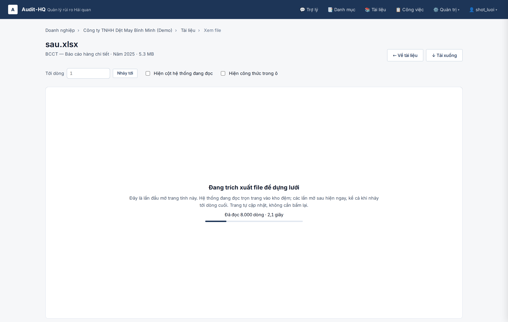
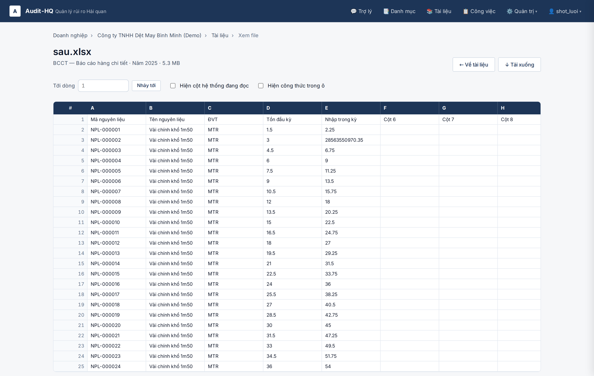
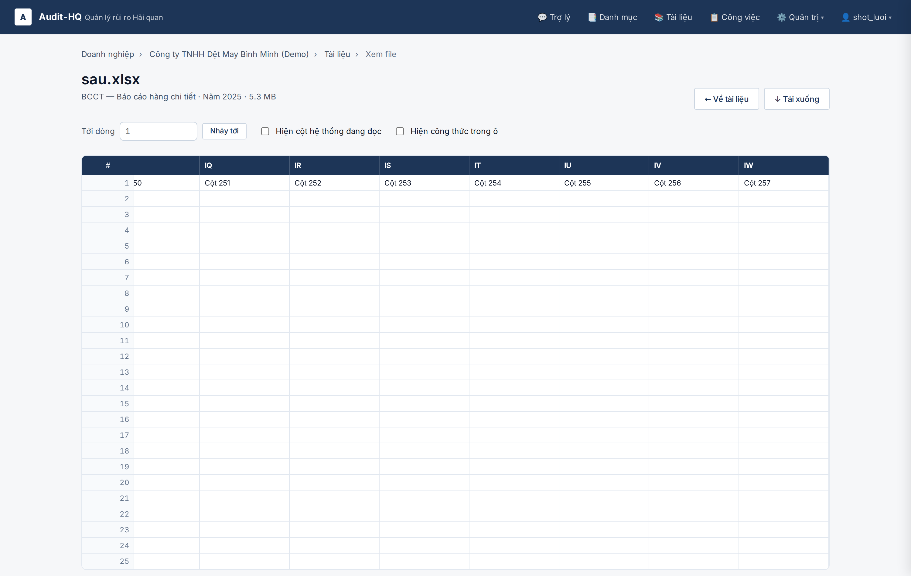
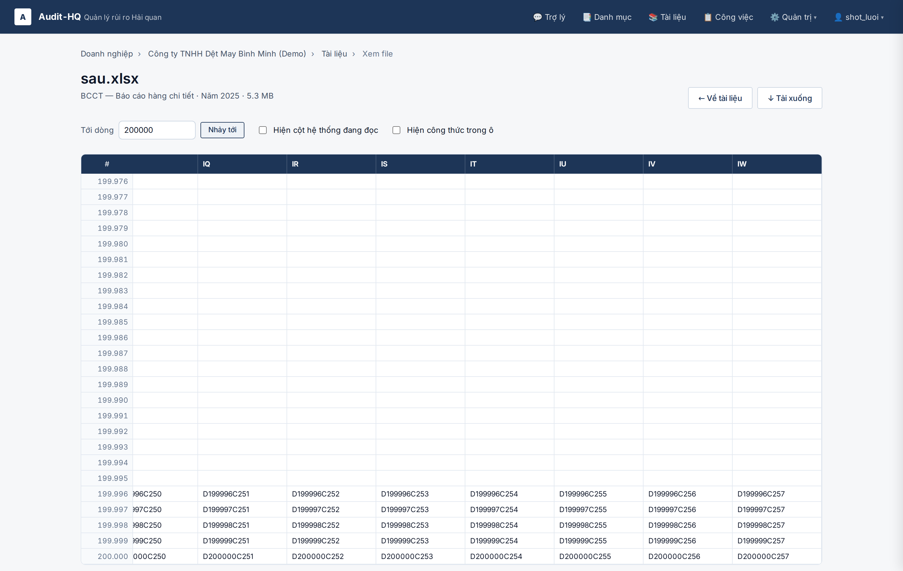
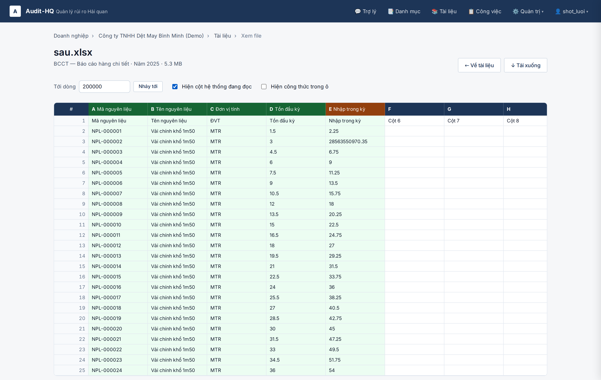
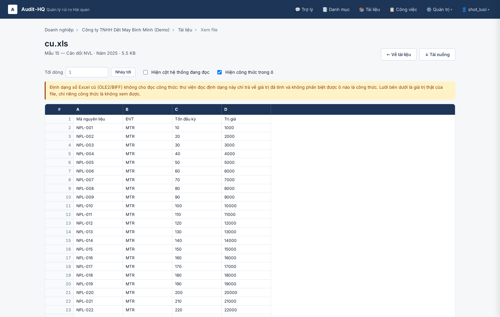
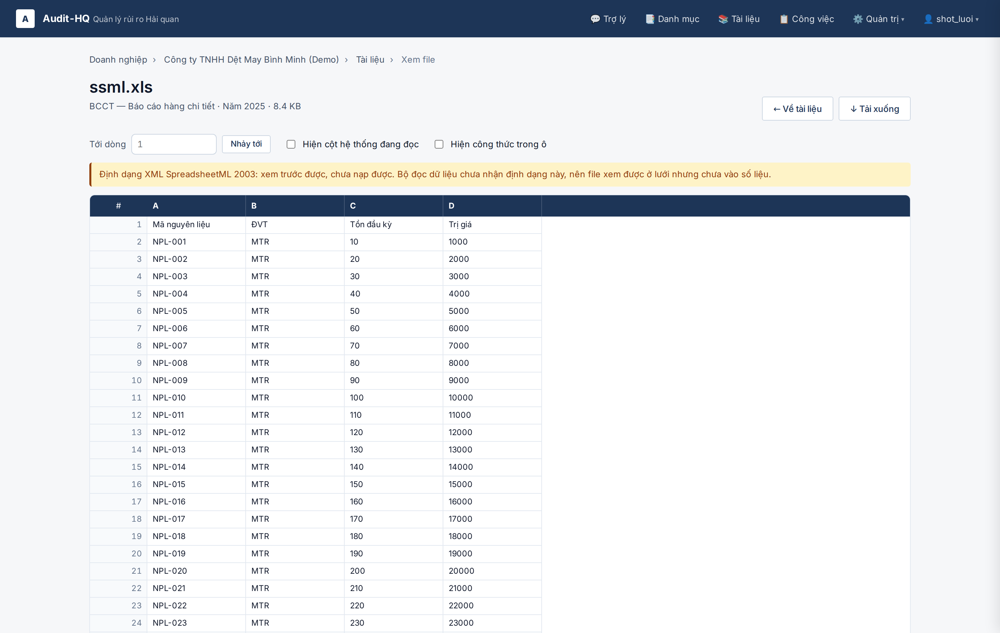

# Issue #91 — Lưới cuộn ảo + hai công tắc ở trang xem file

Ảnh nghiệm thu cho vé #91 (con của #80), dựng trên bộ đọc ô của #83. Bỏ cả ba hạn
mức cũ của trang xem file: 100 dòng, 40 cột, 25 MB.

- **Cột:** 52/170 trang tính đo được vượt 40 cột, rộng nhất 257 → lưới phải tới
  được cột thứ 257.
- **Kích thước:** 11/493 file vượt 25 MB nên trước đây không dựng được lưới, mà
  đó đúng là các file tờ khai lớn.
- **Thời gian:** lượt trích xuất đầu của file `.xlsx` 71,3 MB mất **164,6 giây**,
  vượt biên cắt **100 giây** của Cloudflare. Lưới phải có màn chờ tự hỏi lại.

## Không nhúng thư viện lưới — viết tay

Vé cho phép nhúng một thư viện thành một file tĩnh. Không dùng, vì phần thư viện
làm hộ chỉ còn hai phép nhân: điểm cuối `…/cells` của #83 đã trả sẵn từng **cửa sổ
ô**, còn `total_rows`/`total_cols` là số đo thật từ kết quả trích xuất. Phần khó
nằm ở chỗ không thư viện nào biết: hỏi cửa sổ theo vùng đang xem, màn chờ trích
xuất kèm hỏi lại, hai công tắc gắn với `parse_detail` và với cờ `formulas_supported`.
Nhúng thư viện vẫn phải tự viết toàn bộ phần đó, lại thêm một file tĩnh không ai
trong dự án đọc được. Lưới nằm ở `app/static/cell-grid.js`, JavaScript thuần cùng
lối viết với `app/static/overview-poll.js`; không thêm `package.json`, không thêm
bước build, không liên kết CDN.

Cách dựng: ô nằm ở lớp định vị tuyệt đối trong một khung cuộn cao `tổng dòng × 26px`,
nên trang 200.000 dòng có thanh cuộn thật mà DOM chỉ giữ vài trăm ô. Số dòng và
chữ cái cột là hai lớp riêng dịch theo `scrollLeft`/`scrollTop`.

## Trạng thái đang trích xuất

`GET …/cells` chờ tối đa `PREVIEW_WAIT_SECONDS` (mặc định 12 giây — mọi file trong
kho trừ một file đều trích xuất dưới 10 giây, nên chúng xong trong đúng một request).
Hết hạn chờ thì trả **202** kèm `rows_done` và `elapsed_ms`; lưới hiện màn chờ và
hỏi lại mỗi 2 giây với `wait=0`, nên **không request nào tới gần biên 100 giây** và
cán bộ không phải bấm lại. Lượt dựng chạy ở luồng nền, sống tiếp khi máy khách rớt,
và kho vào chỗ bằng một lần đổi tên nguyên tử.

Hai chỗ phải làm đúng, đã có test khoá:

- Route **chỉ đọc** kho (`read_window`), không bao giờ lùi về dựng đồng bộ. Đo
  được lúc chưa tách: một request dựng tại chỗ mất **46,5 giây** với file 200.000
  dòng — với file 71,3 MB thì đó là 164,6 giây, tức mất trắng lượt xem.
- "Xong" phải có **kho đệm thật** chống lưng, không chỉ là một việc đã kết thúc:
  kho có thể bị dọn theo trần dung lượng sau khi dựng xong.

## Chạy lại

Server throwaway riêng, **KHÔNG đụng DB live hay cổng 8200 của user**. Kill theo
PID, không bao giờ `pkill -f uvicorn`.

```bash
SCRATCH=<thư mục tạm>            # DB + dữ liệu thô + kho đệm + log
mkdir -p "$SCRATCH/data" "$SCRATCH/kho-dem"
DATABASE_URL="sqlite:///$SCRATCH/smoke91.sqlite" .venv/bin/alembic upgrade head

setsid env DATABASE_URL="sqlite:///$SCRATCH/smoke91.sqlite" \
    RAW_DATA_PATH="$SCRATCH/data" PREVIEW_CACHE_PATH="$SCRATCH/kho-dem" \
    PREVIEW_WAIT_SECONDS=0 SESSION_SECRET=smoke-91-secret \
    .venv/bin/uvicorn app.main:app --host 127.0.0.1 --port 8377 --no-access-log \
    > "$SCRATCH/server.log" 2>&1 &
echo $! > "$SCRATCH/server.pid"

M_BASE=http://127.0.0.1:8377 DATABASE_URL="sqlite:///$SCRATCH/smoke91.sqlite" \
    RAW_DATA_PATH="$SCRATCH/data" PREVIEW_CACHE_PATH="$SCRATCH/kho-dem" \
    SESSION_SECRET=smoke-91-secret PYTHONPATH=. \
    .venv/bin/python .ai/features/2026-08-07-luoi-cuon-xem-truoc/ui_smoke.py

kill "$(cat "$SCRATCH/server.pid")"
rm -f "$SCRATCH"/kho-dem/*.sqlite     # chụp lại ảnh 01 thì phải xoá kho đệm
```

`PREVIEW_WAIT_SECONDS=0` để ảnh 01 chụp được màn chờ ngay ở lượt hỏi đầu. Đăng nhập
bằng **cookie ký sẵn** (`make_session_cookie` + `add_cookies`), không qua biểu mẫu:
biểu mẫu có giới hạn số lần và cookie phiên là Secure/HttpOnly nên đường đó trượt
trên http. **Sửa `app/` xong phải khởi động lại server rồi mới chụp** — uvicorn chạy
không `--reload`.

## Ba file dựng trong lúc chạy (dữ liệu bịa, không commit)

| file | dựng để chứng minh |
|---|---|
| `sau.xlsx` — 200.000 dòng × 257 cột, 5,3 MB | cuộn hai chiều, cột thứ 257, nhảy tới dòng 200.000, màn chờ trích xuất (dựng kho ~47 giây trên máy dev). Ô E3 giữ công thức `=D3*1000` với giá trị đã tính 28.563.550.970,35 — đúng con số mà bộ file gộp tay từng làm mất. |
| `cu.xls` — BIFF thật | `.xls` cũ không đọc được công thức: công tắc hiện dòng chữ, lưới vẫn đầy dữ liệu. |
| `ssml.xls` — XML SpreadsheetML mang đuôi `.xls` | trạng thái "xem trước được, chưa nạp được" (38 file trong kho ở dạng này). |

**Chỗ không đo được ở đây:** file `.xlsx` 71,3 MB thật không có trong worktree này
(`data/` là liên kết tới dữ liệu khách, không tồn tại — các test adapter đều bị bỏ
qua vì lý do đó). Dòng 200.000 và cột 257 nghiệm thu trên file dựng ở trên; với
file thật thì lập luận là cửa sổ ô là một truy vấn khoảng trên kho SQLite, chi phí
không phụ thuộc độ sâu — đúng số đo 5 ms của #83 khi nhảy tới dòng cuối.

## Ảnh

Mở file này trên github.com để xem ảnh hiện thẳng trong trang.

### 01 · Màn chờ trích xuất — tiến trình thật, tự hỏi lại

Kho đệm trống nên máy chủ trả 202 ngay; lưới hiện số dòng đã đọc và số giây, tự hỏi
lại mỗi 2 giây. Câu chữ nói rõ đây là lần đầu mở file này, các lần sau hiện ngay,
và trang tự cập nhật chứ không cần bấm lại.



### 02 · Lưới dựng xong — số dòng và chữ cái cột dính mép

Không cần bấm lại: đúng lượt hỏi tiếp theo sau khi kho vào chỗ thì lưới hiện. Ô E3
đang là **28563550970.35** — giá trị đã tính, không phải chuỗi công thức.



### 03 · Cột thứ 257

Cuộn hết sang phải: cột IW là cột thứ 257, dòng tiêu đề vẫn dính mép trên. Hạn mức
40 cột cũ cắt mất 217 cột trong số này.



### 04 · Nhảy tới dòng 200.000

Gõ số dòng rồi bấm "Nhảy tới" — vẫn đang ở mép phải, nên ảnh này chứng minh cả hai
trục cùng lúc: dòng 200.000 × cột 257 giữ `D200000C257`.



### 05 · Công tắc "Hiện cột hệ thống đang đọc"

Năm cột parser thật sự đọc được đánh dấu kèm nhãn trường: A → Mã nguyên liệu, B →
Tên nguyên liệu, C → Đơn vị tính, D → Tồn đầu kỳ, E → Nhập trong kỳ. Cột E màu hổ
phách vì còn `needs_review`. Cột F trở đi không được đọc thì không đánh dấu.

Chú giải chỉ đúng trên **trang tính parser đọc**; xem trang khác thì lưới nói ra
điều đó thay vì đánh dấu nhầm bố cục.



### 06 · Công tắc "Hiện công thức trong ô"

E3 chuyển từ 28563550970.35 sang `=D3*1000`. Công tắc này có mặt vì một bộ file gộp
tay từng lưu 2.076 ô dạng công thức mà bộ đọc trả về 0, mất 28,5 tỷ đồng không kiểm
tra nào bắt được.


### 07 · File `.xls` cũ — nói thẳng là không đọc được công thức

Bật công tắc trên file BIFF: hiện dòng chữ nói định dạng OLE2/BIFF chỉ trả về giá
trị đã tính và không phân biệt được ô nào là công thức. **Lưới vẫn đầy dữ liệu**,
không phải lưới rỗng để cán bộ tự đoán.



### 08 · XML SpreadsheetML — xem trước được, chưa nạp được

38 file trong kho mang đuôi `.xls` nhưng nội dung là XML. Lưới xem được; trang ghi
rõ trạng thái nửa vời đó chứ không để cán bộ tưởng file đã vào số liệu.


